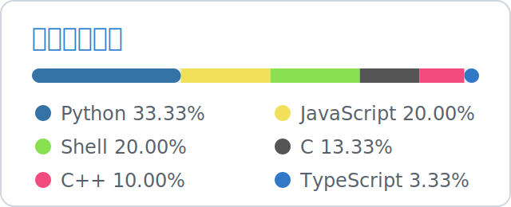

# Gavin · AI / Robotics / Computer Vision

AI Agent developer focused on robotics vision, embedded devices, and full-stack AI applications.

## Featured Projects

| Project | Focus | Stack |
| --- | --- | --- |
| **AI Voice Companion Robot** | LLM + RAG + tool calling with ESP32, camera, audio, and servo control | Python, C/C++, FastAPI, MQTT |
| **[RoboMaster Auto-Aim](https://github.com/lizuju/notos-rm-autoaim)** | armor detection, PnP pose solving, Kalman tracking, STM32 gimbal link | C++, ROS, OpenCV |
| **AI Resume Agent** | JD matching, structured resume data, LaTeX/PDF export | Python, Flask, React |
| **[TAAC 2026](https://github.com/lizuju/TAAC-2026)** | Tencent Ads recommendation model, Public AUC `0.830964`, Top 7% | PyTorch, Transformer |

## Core Stack

`Python` · `C++` · `C` · `JavaScript` · `TypeScript` · `ROS` · `OpenCV` · `PyTorch` · `YOLOv5` · `Flask` · `FastAPI` · `React` · `Vue` · `Docker` · `Linux` · `ESP32`

## Contact

[Website](https://lizuju.github.io) · [Email](mailto:gavinxleele@gmail.com)

---

# Gavin · AI / 机器人 / 计算机视觉

专注 AI Agent、机器人视觉、嵌入式设备和 AI 全栈应用。

## 精选项目

| 项目 | 方向 | 技术 |
| --- | --- | --- |
| **AI 语音陪伴机器人** | LLM、RAG、工具调用、ESP32、摄像头、音频和舵机控制 | Python, C/C++, FastAPI, MQTT |
| **[RoboMaster 自瞄](https://github.com/lizuju/notos-rm-autoaim)** | 装甲板检测、PnP 解算、Kalman 跟踪、STM32 云台通信 | C++, ROS, OpenCV |
| **AI 简历 Agent** | JD 匹配、结构化简历、LaTeX/PDF 导出 | Python, Flask, React |
| **[TAAC 2026](https://github.com/lizuju/TAAC-2026)** | 腾讯广告推荐模型，Public AUC `0.830964`，Top 7% | PyTorch, Transformer |

## 联系我

[个人网站](https://lizuju.github.io) · [邮箱](mailto:gavinxleele@gmail.com)
